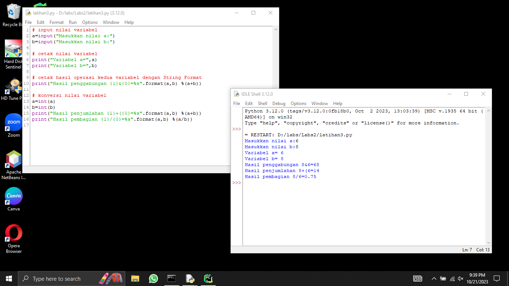

# labs2
## Bahasa Pemrograman Python
### Cara Install Python
Download dan Install Python,
centang Add Python 3.12 to PATH.
#### Perintah Dasar Python
Latihan 1 & 2
Buka CMD,
Menampilkan tulisan "Hello" "Saya sedang belajar python",
Menjumlahkan dua buah bilangan menggunakan variabel a dan b

Latihan 3
Buka IDLE,
Buat file baru rename latihan3.py,
Mengambil nilai variabel dari keyboard,
and run.

Latihan 4
Download dan Install Pycharm,
New project,
\PycharmProject\latihan3
New file,
Rename main.py,
and run.

